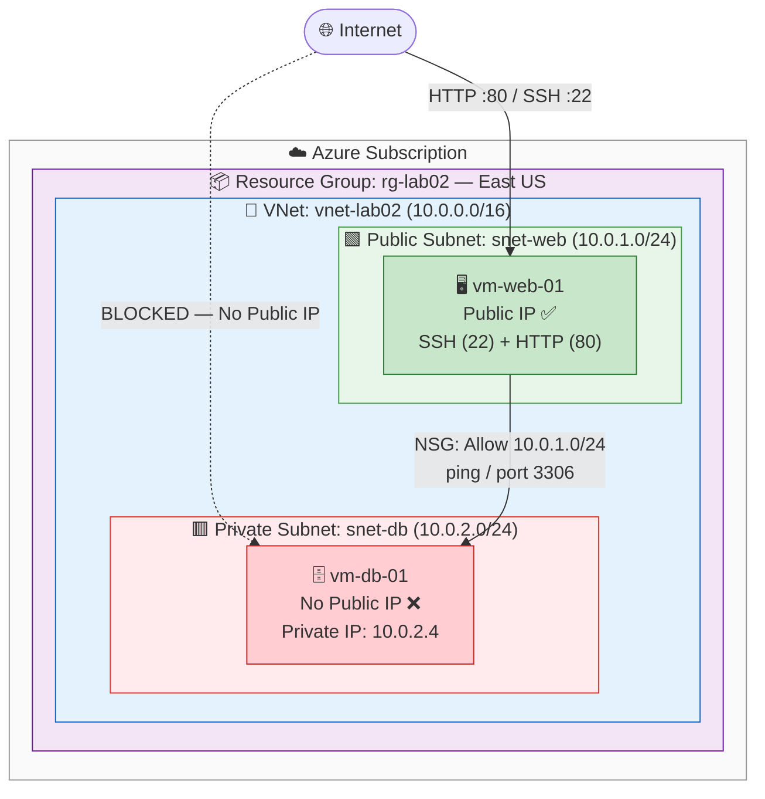

Network Segmentation with Azure VNet and NSGs

## 🎥 Live Demonstration Video

> 📺 **[Watch the full walkthrough here](#)**
>
> *Replace this link with your recorded demo (YouTube, Loom, etc.) showing the VNet creation, VM deployments, jump host connectivity test, and NSG rule configuration.*

---

## 📋 Overview

This lab builds a classic **two-tier IaaS network architecture** inside Azure. A **Virtual Network (VNet)** is segmented into two subnets — a **public-facing web tier** and an **isolated private database tier** — and access between them is enforced using **Network Security Groups (NSGs)**.

This pattern is the foundation of nearly every production cloud environment. Keeping compute and data layers on separate subnets with explicit allow/deny rules is a core **defense-in-depth** principle that limits blast radius if any single resource is compromised.

---

## 🏗️ Architecture Diagram



### Traffic Rules Summary

| Traffic Path | Protocol / Port | Action | Enforced By |
|---|---|---|---|
| Internet → `vm-web-01` | TCP 80, TCP 22 | ✅ Allow | NSG on `snet-web` |
| Internet → `vm-db-01` | Any | ❌ Block | No Public IP assigned |
| `vm-web-01` → `vm-db-01` | ICMP / TCP 3306 | ✅ Allow | NSG rule `Allow-Web-Subnet` |
| Any other source → `vm-db-01` | Any | ❌ Deny | NSG default deny rule |

---

## ✅ Prerequisites

- [ ] Active Azure Subscription
- [ ] Completed Week 2 Video Modules
- [ ] Terminal with SSH capability (macOS/Linux Terminal, or Windows with Git Bash/WSL)
- [ ] Basic understanding of IP addressing and subnets

---

## 🏷️ Naming Convention & IP Scheme

| Resource | Value |
|---|---|
| Resource Group | `rg-lab02` |
| Virtual Network | `vnet-lab02` |
| Address Space | `10.0.0.0/16` |
| Public Subnet | `snet-web` — `10.0.1.0/24` |
| Private Subnet | `snet-db` — `10.0.2.0/24` |
| Web VM | `vm-web-01` |
| Database VM | `vm-db-01` |
| DB Private IP | `10.0.2.4` (auto-assigned) |
| SSH Key Pair | `key-lab02` |
| Region | East US |

---

## 🛠️ Implementation Steps

### Phase 1 — Build the Network Foundation

1. In the Azure Portal, search **Virtual Networks** → **+ Create**.
2. Configure:
   - **Resource group:** Create new → `rg-lab02`
   - **Name:** `vnet-lab02`
   - **Region:** East US
3. Under **IP Addresses**, set address space to `10.0.0.0/16` and add two subnets:
   - `snet-web` → `10.0.1.0/24`
   - `snet-db` → `10.0.2.0/24`
4. **Review + create** → **Create**.

---

### Phase 2 — Deploy the Web Server (Public Tier)

1. Search **Virtual Machines** → **+ Create**.
2. Configure:
   - **Resource group:** `rg-lab02`
   - **Name:** `vm-web-01`
   - **Region:** East US
   - **Image:** Ubuntu Server 20.04 LTS
   - **Size:** Standard_B1s
   - **Key pair name:** `key-lab02`
   - **Public inbound ports:** HTTP (80) and SSH (22)
3. Under **Networking**, confirm subnet is set to `snet-web` and **Public IP** is set to **Create New (Standard)**.
4. **Review + create** → **Create**.

> 💾 **Download the `.pem` private key when prompted — you cannot retrieve it afterward.**

---

### Phase 3 — Deploy the Database Server (Private Tier)

1. Create another Virtual Machine with the following config:
   - **Name:** `vm-db-01`
   - **Image:** Ubuntu Server 20.04 LTS
   - **Size:** Standard_B1s
   - **Key pair:** Use existing → `key-lab02`
   - **Public inbound ports:** SSH (22) only
2. Under **Networking** — this is the critical section:
   - **Virtual Network:** `vnet-lab02`
   - **Subnet:** `snet-db` ← *must be changed from default*
   - **Public IP:** **None** ← *this server must not be internet-reachable*
3. **Review + create** → **Create**.

> 🔒 **Security note:** Removing the public IP means this VM has no internet-facing attack surface. It can only be reached from within the VNet.

---

### Phase 4 — Validate Connectivity via Jump Host

Since `vm-db-01` has no public IP, direct SSH from your local machine is impossible by design. Instead, you **jump through the web server** to reach the database server.

**Step 1 — Get the DB Server's private IP:**
- Navigate to `vm-db-01` → Overview → copy the **Private IP address** (should be `10.0.2.4`).

**Step 2 — SSH into the Web Server:**
```bash
chmod 600 key-lab02.pem
ssh -i key-lab02.pem azureuser@<PUBLIC-IP-OF-VM-WEB-01>
```

**Step 3 — Ping the DB Server from inside the Web Server:**
```bash
ping 10.0.2.4
```

Expected output:
```
PING 10.0.2.4 (10.0.2.4) 56(84) bytes of data.
64 bytes from 10.0.2.4: icmp_seq=1 ttl=64 time=1.23 ms
64 bytes from 10.0.2.4: icmp_seq=2 ttl=64 time=0.98 ms
```

> ✅ Successful ping confirms both VMs are communicating inside `vnet-lab02`. Press `Ctrl + C` to stop.

---

### Phase 5 — Harden with NSG Rules

By default, Azure's VNet allows all internal subnet-to-subnet traffic. This phase explicitly locks down `vm-db-01` so **only the web subnet** can initiate connections.

1. Navigate to `vm-db-01` → **Networking** tab.
2. Click the **Network Security Group** link (auto-named, e.g., `vm-db-01-nsg`).
3. Select **Inbound security rules** → **+ Add**.
4. Configure the rule as follows:

| Field | Value |
|---|---|
| Source | IP Addresses |
| Source IP / CIDR | `10.0.1.0/24` |
| Source port ranges | `*` |
| Destination | Any |
| Service | Custom |
| Destination port ranges | `*` (or `3306` for MySQL / `5432` for PostgreSQL) |
| Action | **Allow** |
| Priority | `100` |
| Name | `Allow-Web-Subnet` |

5. Click **Add**.

> 🛡️ **Why this matters:** The default Azure NSG deny-all rule (priority 65500) blocks anything not explicitly permitted. By adding this rule at priority 100, only traffic sourced from `10.0.1.0/24` (the web tier) is allowed into the DB — all other sources are dropped.

---

## 🧪 Validation Checklist

- [ ] `vnet-lab02` exists with both `snet-web` and `snet-db` subnets
- [ ] `vm-web-01` is in `snet-web` with a public IP assigned
- [ ] `vm-db-01` is in `snet-db` with **no** public IP
- [ ] SSH into `vm-web-01` via its public IP succeeds
- [ ] `ping 10.0.2.4` from `vm-web-01` returns replies
- [ ] NSG rule `Allow-Web-Subnet` is present on `vm-db-01-nsg`

---

## 🐛 Troubleshooting

| Issue | Likely Cause | Fix |
|---|---|---|
| Ping fails between VMs | `vm-db-01` deployed to wrong subnet | Check the **Networking** tab of `vm-db-01` and confirm it shows `snet-db` |
| Ping fails between VMs | VMs in different VNets | Confirm both VMs list `vnet-lab02` under their Networking tab |
| Cannot SSH directly to `vm-db-01` | No public IP — this is expected and correct | SSH into `vm-web-01` first, then jump to the DB server |
| SSH key permission error | `.pem` file permissions too open | Run `chmod 600 key-lab02.pem` before connecting |
| VM creation fails on size | `Standard_B1s` unavailable in region | Try `Standard_B2s` or switch region to **West US 2** |

---

## 🧹 Cleanup

1. Navigate to **Resource Groups**.
2. Select `rg-lab02-[yourname]`.
3. Click **Delete resource group** → type the name to confirm → **Delete**.

> 💡 This removes the VNet, both VMs, the NSGs, the public IP, the key pair, and all associated disks in a single operation.

---

## 🎯 Key Concepts Demonstrated

- **Network Segmentation:** Splitting workloads into public and private subnets to limit lateral movement
- **Defense in Depth:** Layering controls — no public IP *plus* NSG rules — rather than relying on a single mechanism
- **Jump Host Pattern:** Using an internet-facing host as a controlled entry point to reach private resources
- **NSG Rule Logic:** Priority-based allow/deny rules and how Azure evaluates them top-down
- **Principle of Least Privilege:** The DB server only accepts traffic from the specific subnet that needs it, nothing else

---

## 📁 Repository Structure

```
.
├── README.md
└── diagrams/
    └── lab02-architecture.png
```

---

## 📜 License

This lab documentation is provided for educational purposes as part of a cloud security/fundamentals training series.
